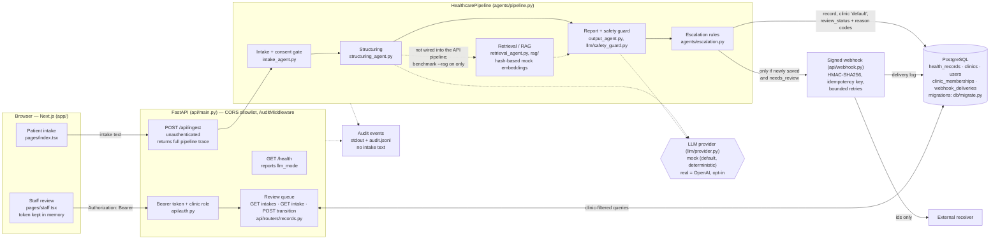

# Architecture Diagram

Implemented system at the end of Phase 6 (#34, #35). Solid arrows are active request paths; dashed arrows are code that exists but is not on the API's runtime path, or is optional configuration. Sources are named on each node.

Notes (each checked against the code):

* `api/deps.py` builds `HealthcarePipeline()` without a `RetrievalAgent`, so `/api/ingest` traces show `rag.enabled: false`.
* Persistence and the webhook are best-effort: a database or delivery problem never fails `/api/ingest` (`agents/pipeline.py`, `api/webhook.py`).
* The webhook payload is `event`, `schema_version`, `idempotency_key`, `intake_id`, `clinic_id` (`EscalationPayload`, `extra="forbid"`).
* Clinic access is decided from database memberships on every request; another clinic's intake reads as 403 (other clinic's path) or 404 (own path).
* Redis in `docker-compose.yml` is unused and not deployed.
* Hosted deployment (`render.yaml`): API and frontend as Docker web services, PostgreSQL managed by Render ([`../deployment.md`](../deployment.md)).
