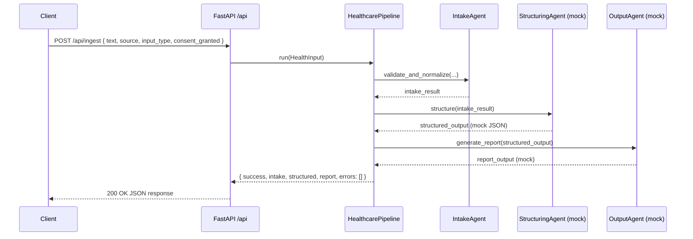

# Step 2 — System Architecture

Healthcare AI Platform — System Architecture Specification
Target: Healthcare LLM + Agent Platform with RAG, Safety, and EHR-Ready Design

This document describes how the system is structured end-to-end:

* How requests flow from UI to API to agents and back
* How LLM calls, RAG, safety, and persistence are composed
* How the design anticipates HIPAA, interoperability (FHIR/HL7), and evaluation

It is the architectural reference for both implementation and portfolio review.

---

## 1. High-Level Architecture Overview

At a high level, the platform is a **backend-centric AI service** with a thin demo UI:

* **Frontend (`app/`)**
  Simple React/Next.js UI to submit health-related input and display reports.

* **Backend API (`api/`)**
  FastAPI service that exposes REST endpoints (currently `/api/ingest`) and wires HTTP requests into the internal agent pipeline.

* **Agent Orchestration (`agents/`)**
  Encapsulated “mini agents” that each have a single responsibility:

  * `IntakeAgent` – input normalization and validation
  * `StructuringAgent` – LLM-driven JSON structuring
  * `RetrievalAgent` – RAG integration (Phase 2+)
  * `OutputAgent` – final human-readable report generation
  * `HealthcarePipeline` – orchestrator that chains agents

* **LLM Layer (`llm/`)**
  Prompts, schemas, and safety guard around any LLM provider (mock in Phase 1, real in Phase 3+).

* **RAG Layer (`rag/`)**
  Vector store, embeddings, and retrieval flows for grounding health content.

* **Persistence (`db/`)**
  PostgreSQL models and sessions for storing structured records and reports.

* **Interoperability (`interoperability/`)**
  FHIR/HL7 clients and an EHR router to enable future EMR/EHR connectivity.

* **Infrastructure & Observability (`infra/`, `observability/`)**
  Docker, AWS/IaC, logging, metrics, and tracing.

---

## 2. Component Diagram

Conceptual component view:

```mermaid
graph TD

subgraph Client
  UI[Demo Web UI (app/)]
end

subgraph Backend
  API[FastAPI API (api/)]
  PIPE[HealthcarePipeline (agents/pipeline.py)]

  subgraph Agents
    INTAKE[IntakeAgent]
    STRUCT[StructuringAgent]
    RETR[RetrievalAgent (Phase 2+)]
    OUTPUT[OutputAgent]
  end

  subgraph LLM
    PROMPTS[Prompts (llm/prompts)]
    SCHEMAS[Schemas (llm/schemas)]
    SAFETY[Safety Guard (llm/safety_guard.py)]
  end

  subgraph RAG
    VSTORE[Vector Store (rag/vector_store.py)]
    EMBED[Embeddings (rag/embeddings.py)]
  end

  subgraph Data
    DB[(PostgreSQL)]
  end

  subgraph Interop
    FHIR[Interop FHIR Client]
    HL7[HL7 Parser]
    ROUTER[EHR Router]
  end

  subgraph Infra
    AWS[AWS / Docker / IaC]
    OBS[Observability (metrics, audit, tracing)]
  end
end

UI -->|HTTP| API
API -->|call| PIPE
PIPE --> INTAKE
PIPE --> STRUCT
PIPE --> RETR
PIPE --> OUTPUT

STRUCT --> LLM
RETR --> RAG
OUTPUT --> LLM

PIPE --> DB
PIPE --> OBS

PIPE --> ROUTER
ROUTER --> FHIR
ROUTER --> HL7
```

---

## 3. Backend API Layer (`api/`)

### 3.1 Responsibilities

* Expose HTTP endpoints to clients
* Validate requests using Pydantic models
* Invoke `HealthcarePipeline` with normalized input
* Map internal errors to consistent HTTP responses
* Provide health and system introspection endpoints

### 3.2 Key Modules

* `api/main.py`

  * FastAPI app initialization
  * Router registration (`/api/ingest`)
  * Health check & root endpoints
  * Startup/shutdown logging

* `api/routers/ingest.py`

  * `POST /api/ingest`: main entry for health input
  * Defines request/response models
  * Calls `HealthcarePipeline.run()`
  * Converts domain exceptions into HTTP status codes

* `api/deps.py`

  * Dependency injection of pipeline instances
  * Future place for per-request context and auth

### 3.3 Error Mapping

The API layer standardizes error handling:

* 422 – FastAPI validation (missing/invalid fields)
* 400 – Intake validation errors (e.g., empty input)
* 422/500 – Structuring or Output failures, depending on severity
* 500 – Unexpected internal exceptions

Full error model is summarized in `docs/step5_demo_eval.md`.

---

## 4. Agent Orchestration Layer (`agents/`)

The agents layer encapsulates the core health workflow. Each agent is small, testable, and independently improvable.

### 4.1 IntakeAgent (`agents/intake_agent.py`)

**Purpose:**
Normalize raw user input into a standard `HealthInput` structure and enforce consent.

**Responsibilities:**

* Validate raw text presence and length
* Normalize metadata (source, input type)
* Enforce `consent_granted` rules
* Emit a strongly typed `HealthInput` dict compatible with downstream processing

---

### 4.2 StructuringAgent (`agents/structuring_agent.py`)

**Purpose:**
Convert normalized intake data into structured, clinical-style JSON using an LLM.

**Responsibilities:**

* Construct prompt using `llm/prompts/structuring.txt`
* Call a pluggable LLM interface (mock in Phase 1, provider in Phase 3+)
* Enforce schema via `llm/schemas/structured_output.json`
* Raise `StructuringError` if output is invalid or unsafe

---

### 4.3 RetrievalAgent (`agents/retrieval_agent.py` – Phase 2+)

**Purpose:**
Enhance LLM reasoning with clinical knowledge grounding (RAG).

**Responsibilities:**

* Convert intake/structured data into a retrieval query
* Use `rag/vector_store.py` and `rag/embeddings.py` to fetch relevant documents
* Return a set of context chunks for the LLM
* Support toggling retrieval on/off for A/B evaluation

---

### 4.4 OutputAgent (`agents/output_agent.py`)

**Purpose:**
Generate a human-readable, safe summary report.

**Responsibilities:**

* Apply `llm/prompts/report.txt` with structured data (and optional retrieved context)
* Enforce `ReportOutput` schema (`llm/schemas/report_output.py`)
* Call the Safety Guard before finalizing text
* Return a `{"summary": "...", ...}` object

---

### 4.5 HealthcarePipeline (`agents/pipeline.py`)

**Purpose:**
Coordinate all agents into a single end-to-end pipeline.

**High-level flow (Phase 1):**

```text
HealthInput → IntakeAgent → StructuringAgent → OutputAgent → Result
```

Planned extension (Phase 2+):

```text
HealthInput → IntakeAgent
            → StructuringAgent
            → RetrievalAgent (optional, RAG)
            → OutputAgent (uses structured + retrieved context)
            → DB Persistence + Observability
```

**Outputs:**

* `success: bool`
* `intake`: normalized intake data
* `structured`: schema-validated structured output
* `report`: summary object
* `errors`: optional error list
* Optional trace for internal diagnostics

---

## 5. LLM Layer (`llm/`)

### 5.1 Prompts (`llm/prompts/`)

* `structuring.txt`
  Prompt for transforming unstructured text into structured JSON.
* `reasoning.txt`
  Reserved for deeper reasoning or future agent chains.
* `report.txt`
  Prompt for generating user-facing health summaries.

All prompts are designed to:

* Enforce JSON-only output where required
* Avoid medical diagnosis or treatment prescription if out of scope
* Respect safety and compliance constraints

### 5.2 Schemas (`llm/schemas/`)

* `health_input.json`
  Standard for normalized intake.
* `structured_output.json`
  Canonical schema for structured health data (symptoms, duration, context, etc.).
* `report_output.json`
  Schema for report objects (summary, sections, disclaimers, etc.).

Schemas are validated at runtime to:

* Detect malformed LLM outputs
* Provide predictable structures to clients
* Support future data export to EHR systems

### 5.3 Safety Guard (`llm/safety_guard.py`)

**Purpose:**

* Enforce content policies (no direct diagnosis)
* Mask or avoid PHI where needed
* Catch sensitive or out-of-scope responses before returning to clients

Planned behavior:

* Rule-based filters for prohibited patterns
* Optional integration with external safety classifiers
* Hooks at both structuring and output stages

---

## 6. RAG Layer (`rag/`)

### 6.1 Embeddings (`rag/embeddings.py`)

* Compute vector representations for medical text and documents
* Pluggable embedding backend (OpenAI, local model, etc.)
* Designed for offline indexing and online query usage

### 6.2 Vector Store (`rag/vector_store.py`)

* Abstracts underlying vector DB (FAISS, Chroma, etc.)
* Supports insert/update/search operations
* Encapsulates index configuration (dimension, distance, filtering)

### 6.3 Retriever (`rag/retriever.py`)

* High-level interface from agents to vector store
* Accepts semantic queries and returns ranked context chunks
* Designed to integrate smoothly with `RetrievalAgent`

---

## 7. Persistence Layer (`db/`)

### 7.1 Models (`db/models.py`)

Future model examples:

* `HealthSession` – per user session / interaction
* `HealthRecord` – structured data snapshot
* `Report` – user-facing summary, with versioning
* Audit columns (created_at, updated_at, status, etc.)

### 7.2 Migrations (`db/migrations/`)

* `init.sql`: base schema
* Future migrations for new fields and tables

### 7.3 Session Management (`db/session.py`)

* Centralized database engine and session factory
* Designed for dependency injection into API routes or agents
* Prepared for a HIPAA-style secure deployment (encryption at rest, restricted access)

---

## 8. Interoperability Layer (`interoperability/`)

### 8.1 FHIR Client (`interoperability/fhir_client.py`)

* Client abstraction for interacting with FHIR R4 endpoints
* Handles authentication, paging, and resource CRUD
* Target use cases: reading/writing Observations, Conditions, Encounters

### 8.2 HL7 Parser (`interoperability/hl7_parser.py`)

* Transform HL7 v2 messages into internal data structures
* Provide mapping to FHIR or structured JSON representations

### 8.3 Consent Management (`interoperability/consent.py`)

* Encapsulate consent logic for data sharing
* Align user consent flags with EHR data flows

### 8.4 EHR Router (`interoperability/ehr_router.py`)

* Central router that decides which EHR/EMR integration to use
* Designed to later support: Epic, Cerner, Cerbo, Salesforce Health, etc.
* Built to fit “universal interoperability layer” style project requirements

---

## 9. Observability & Compliance

### 9.1 Observability (`observability/`)

* `audit_logger.py` – structured audit logs for sensitive operations
* `metrics.py` – business and technical KPIs (latency, errors, token usage)
* `tracing.py` – request and pipeline-level tracing hooks

### 9.2 Compliance (`compliance/`)

* `hipaa_overview.md` – high-level HIPAA posture description
* `data_flow.md` – end-to-end PHI / non-PHI data flow
* `threat_model.md` – threat modeling and mitigations
* `rbacs.md` – role-based access control design
* `baa_map.md` – mapping to BAA-covered services

These documents align the architecture with healthcare SaaS expectations (HIPAA / GDPR ready design).

---

## 10. Deployment & Infrastructure (`infra/`)

### 10.1 Local Development

* `docker-compose.yml`

  * API container
  * PostgreSQL
  * Redis (reserved for caching/queueing)
* `Makefile`

  * `make up`
  * `make down`
  * `make logs`

### 10.2 Cloud / IaC (`infra/aws/`)

* `s3.tf` – storage for logs/reports or call recordings
* `lambda.tf` – serverless experimentation / background jobs
* `iam.tf` – AWS IAM roles/policies
* `rds.tf` – managed PostgreSQL instance

This structure allows mapping directly to job descriptions that require AWS, HIPAA-ready architectures, and IaC.

---

## 11. Request–Response Flow (Sequence)

Current Phase-1 flow (mock LLM):



Future Phase-2+ flow will insert:

* `RetrievalAgent` (RAG) between structuring and report generation
* DB persistence after successful pipeline execution
* Safety Guard checks around structuring and output

---

## 12. Runtime Modes: Mock vs Real LLM

The architecture intentionally separates:

* **Mock mode** (Phase 1):

  * Deterministic outputs for reliable tests
  * No external dependencies
  * Ideal for early pipeline and infra work

* **Real LLM mode** (Phase 3+):

  * Switched via config (`settings.app_env` / env var)
  * Same interface, different backend
  * Enables real evaluation and portfolio demos

This dual-mode design is important for:

* CI reliability
* Cost control
* Reproducible evaluation

---

## 13. Extensibility

The architecture is intentionally **open-ended** for:

* Additional agents (e.g., triage agent, specialist routing agent)
* New endpoints (analytics, reports, clinician portal)
* Deeper EHR integration projects (router → Epic/Cerner, etc.)
* Enhanced safety layers or external AI safety services
* Multi-tenant SaaS features (per-clinic configurations, usage metering)

This makes the repository align naturally with Gen-AI engineer roles (RAG, agents, evaluation), and healthcare AI SaaS / interoperability / HIPAA projects. It is both a working system and a reusable architectural blueprint.
